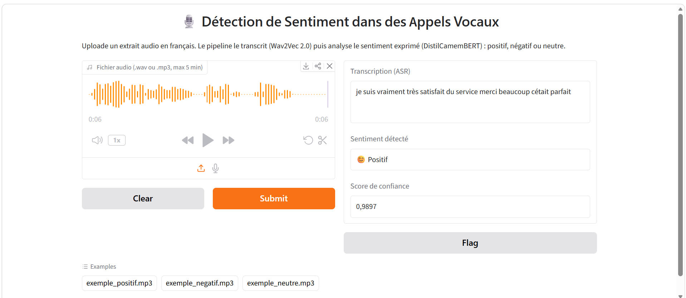

# 🎙️ Détection Automatique de Sentiment dans des Appels Vocaux

---

## 📐 Architecture

```
Audio (.wav/.mp3)
      │
      ▼
Prétraitement (mono, 16kHz, normalisation)
      │
      ▼
ASR — Wav2Vec 2.0 (jonatasgrosman/wav2vec2-large-xlsr-53-french)
      │
      ▼
Sentiment — CamemBERT/DistilBERT fine-tuné
      │
      ▼
{ transcription, sentiment, confidence }
```

---

## 🗂️ Structure du projet

```
voice-sentiment-pipeline/
├── src/
│   ├── asr/            # Prétraitement audio + transcription Wav2Vec 2.0
│   ├── sentiment/      # Modèle de classification de sentiment
│   ├── api/            # API REST (FastAPI)
│   └── ui/             # Interface Gradio
├── tests/               # Tests unitaires (pytest)
├── notebooks/           # Exploration / expérimentation
├── test_audio/          # 3 fichiers audio de démo (1 par classe)
├── docs/                # Documentation complémentaire, schémas
├── requirements.txt
├── Dockerfile           # (bonus)
├── .gitignore
└── README.md
```

---

## ⚙️ Installation

```bash
# 1. Cloner le repo
git clone https://github.com/<username>/voice-sentiment-pipeline.git
cd voice-sentiment-pipeline

# 2. Créer un environnement virtuel
python3 -m venv venv
source venv/bin/activate

# 3. Installer les dépendances
pip install -r requirements.txt
```

---

## 🚀 Utilisation

### Interface Gradio

En local :
```bash
python src/ui/app.py
```

Sur Google Colab :
```python
import sys
sys.path.append(".")
from src.ui.app import demo

demo.launch(share=True, debug=True)
```
Un lien public temporaire (`https://f978563e9418f4fe03.gradio.live`) s'affiche.

Ouvre l'interface dans le navigateur, upload un fichier `.wav` ou `.mp3` et affiche la transcription intermédiaire ainsi que le sentiment détecté.



### API REST

En local :
```bash
uvicorn src.api.main:app --reload
```

Sur Google Colab (utilisé pour le développement et les tests, GPU disponible), le serveur est exposé publiquement via un tunnel [ngrok](https://ngrok.com) :
```python
import subprocess, time, requests
from pyngrok import ngrok

ngrok.set_auth_token("TOKEN_NGROK")  # gratuit sur dashboard.ngrok.com
process = subprocess.Popen(["uvicorn", "src.api.main:app", "--host", "0.0.0.0", "--port", "8000"])
time.sleep(30)
public_url = ngrok.connect(8000)
print("API accessible sur :", public_url)
```

Une documentation interactive (Swagger) est disponible automatiquement sur `/docs`.

Exemple d'appel avec `curl` :

```bash
curl -X POST "http://127.0.0.1:8000/predict" \
  -F "file=@test_audio/exemple_positif.mp3"
```

Exemple d'appel avec le script Python fourni (`examples/call_api_example.py`) :

```bash
python examples/call_api_example.py test_audio/exemple_positif.mp3
```

Réponse JSON réelle obtenue (testée en conditions réelles via l'API exposée sur Colab) :

```json
{
  "transcription": "bonjour je vous appelle pour vous dire que je suis vraiment très satisfait du service que jai reçu la semaine dernière le technicien a été ponctuel professionnel et le problème a été réglé rapidement merci beaucoup cétait parfait",
  "sentiment": "positif",
  "confidence": 0.9798
}
```

---

## 🧠 Modèles utilisés

| Tâche      | Modèle                                                      | Justification                                                                 |
|------------|--------------------------------------------------------------|--------------------------------------------------------------------------------|
| ASR        | [`jonatasgrosman/wav2vec2-large-xlsr-53-french`](https://huggingface.co/jonatasgrosman/wav2vec2-large-xlsr-53-french) | Fine-tuné spécifiquement pour le français à partir de XLSR-53, avec de bonnes performances (WER) publiées sur sa fiche Hugging Face. Facilement utilisable via `transformers` (classes `Wav2Vec2ForCTC` / `Wav2Vec2Processor`), sans configuration supplémentaire. |
| Sentiment  | [`cmarkea/distilcamembert-base-sentiment`](https://huggingface.co/cmarkea/distilcamembert-base-sentiment) | Version distillée de CamemBERT (environ 2x plus rapide, taille réduite), entraînée sur des avis clients (Amazon Reviews, Allociné) avec près de 38k téléchargements sur Hugging Face. Le modèle prédit nativement une note sur 5 étoiles ; nous la mappons vers 3 classes (1-2 étoiles → négatif, 3 → neutre, 4-5 → positif). Un seuil de confiance (0.6) a été ajouté en post-traitement : lorsque le score de la classe gagnante (positif/négatif) reste trop faible — signe d'hésitation du modèle sur un texte sans opinion claire — la prédiction bascule automatiquement vers "neutre". |

Liens Hugging Face :
- ASR : https://huggingface.co/jonatasgrosman/wav2vec2-large-xlsr-53-french
- Sentiment : https://huggingface.co/cmarkea/distilcamembert-base-sentiment

---

## ✅ Gestion des erreurs

Le pipeline gère proprement :
- Formats de fichiers non supportés (autre que `.wav`/`.mp3`)
- Fichiers audio vides ou corrompus
- Audio silencieux (aucune transcription détectée)
- Fichiers dépassant la durée maximale (5 minutes)

---

## 🧪 Démonstration

3 fichiers audio de test sont fournis dans `test_audio/`, un par classe de
sentiment (positif, négatif, neutre), avec les résultats attendus documentés
dans `docs/demo_results.md`.

---

## 📊 Évaluation quantitative (bonus)

Le pipeline a été évalué sur les 3 fichiers de test annotés : **WER de 5.05%**
pour la transcription ASR, et **F1-macro de 100%** pour la classification de
sentiment. Détails complets et méthodologie dans
[`docs/evaluation_results.md`](docs/evaluation_results.md).

```bash
python src/evaluate.py
```

---

## 🐳 Docker (bonus)

Construire l'image (installe les dépendances, copie le code et les fichiers de démo) :
```bash
docker build -t voice-sentiment-pipeline .
```

Lancer le conteneur (l'API sera accessible sur `http://localhost:8000`) :
```bash
docker run -p 8000:8000 voice-sentiment-pipeline
```

Tester ensuite comme n'importe quel appel à l'API :
```bash
curl -X POST "http://localhost:8000/predict" \
  -F "file=@test_audio/exemple_positif.mp3"
```

⚠️ **Note** : les modèles Hugging Face (ASR + sentiment, ~1.5 Go au total) sont
téléchargés au premier démarrage du conteneur (pas inclus dans l'image pour la
garder légère), donc le tout premier lancement peut prendre quelques minutes le
temps du téléchargement. Les lancements suivants sont plus rapides si le cache
Hugging Face est monté en volume persistant.

---

## ⚠️ Limites connues

- Le pipeline est optimisé pour le français uniquement.
- La qualité de la transcription dépend fortement du bruit de fond et de la qualité d'enregistrement.
- Le modèle de sentiment n'a pas été entraîné spécifiquement sur du langage oral transcrit (peut contenir des disfluences, hésitations, etc.).
- Durée maximale supportée : 5 minutes par fichier.
